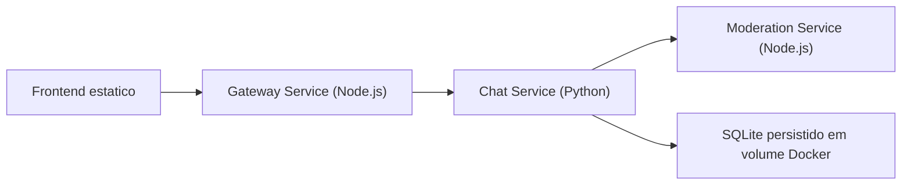

# Chat Distribuido Node + Python

Projeto academico de chat distribuido, pensado para apresentar conceitos de **sistemas distribuidos** de forma pratica, simples e funcional. A arquitetura separa responsabilidades em servicos pequenos, usa comunicacao HTTP/REST, persiste mensagens e inclui tratamento basico de falhas.

## Visao geral da arquitetura


```

### Servicos

- **Gateway Service (`chat-app`)**: recebe as requisicoes do navegador, serve o frontend e centraliza o acesso ao backend.
- **Chat Service (`chat-python`)**: concentra a regra de negocio do chat, valida mensagens, chama a moderacao e persiste os dados.
- **Moderation Service (`moderation-service`)**: servico stateless, pequeno e facil de escalar, responsavel por aprovar ou bloquear mensagens.

## Por que essa arquitetura?

- **Separacao de responsabilidades**: cada servico tem uma funcao clara e facil de explicar.
- **Melhor disponibilidade**: o gateway continua no ar mesmo se o chat estiver temporariamente indisponivel, e o chat pode operar em modo degradado se a moderacao falhar.
- **Melhor confiabilidade**: mensagens sao persistidas em banco local SQLite, evitando perda de historico ao reiniciar containers.
- **Escalabilidade basica**: gateway e moderacao sao stateless, entao podem ser replicados com mais facilidade.
- **Manutencao simples**: cada servico possui configuracao por ambiente, logs estruturados e codigo pequeno.

## Decisoes arquiteturais

### 1. Gateway em Node.js

Foi mantido em Node.js para representar a camada de entrada do sistema. Ele serve o frontend e encapsula as chamadas para o servico Python. Isso evita expor a logica interna diretamente ao navegador.

### 2. Chat Service em Python

O Python ficou com a regra principal do sistema: validacao, integracao com outros servicos e persistencia. Essa separacao deixa evidente o conceito de servico de negocio.

### 3. Moderation Service separado

A moderacao foi extraida para um servico REST independente para demonstrar:

- chamada entre servicos;
- retry basico;
- degradacao controlada;
- possibilidade de escalar ou alterar essa regra sem mexer no servico principal.

### 4. SQLite no lugar de um banco mais pesado

SQLite foi escolhido para simplificar a demonstracao e reduzir barreiras de execucao local. Para um trabalho de faculdade, isso ajuda a focar nos conceitos distribuidos centrais sem adicionar complexidade desnecessaria de infraestrutura.

### 5. Polling no frontend

Foi usada atualizacao periodica em vez de WebSocket para manter o fluxo mais simples de explicar e testar. O foco aqui esta na distribuicao de responsabilidades entre servicos, e nao em tempo real sofisticado.

## Estrutura de pastas

```text
NodePython-Chat/
|-- chat-app/
|   |-- public/
|   |-- src/
|   `-- Dockerfile
|-- chat-python/
|   |-- data/
|   |-- src/
|   `-- Dockerfile
|-- moderation-service/
|   |-- src/
|   `-- Dockerfile
|-- .env.example
|-- docker-compose.yml
`-- README.md
```

## Funcionalidades distribuidas demonstradas

- comunicacao entre servicos via HTTP/REST;
- retry basico do gateway ao falar com o chat service;
- retry basico do chat service ao falar com a moderacao;
- modo degradado: se a moderacao cair, o chat ainda salva a mensagem como `pending_review`;
- health checks para todos os servicos;
- logs estruturados em JSON;
- persistencia simples em arquivo SQLite com volume Docker;
- configuracao centralizada por variaveis de ambiente.

## Variaveis de ambiente principais

- `GATEWAY_PORT`: porta HTTP do gateway.
- `CHAT_SERVICE_PORT`: porta HTTP do servico Python.
- `MODERATION_PORT`: porta HTTP do servico de moderacao.
- `GATEWAY_REQUEST_TIMEOUT_MS`: tempo maximo que o gateway espera pelo chat service.
- `GATEWAY_MAX_RETRIES`: quantidade de retries do gateway ao chamar o chat.
- `MODERATION_REQUEST_TIMEOUT_SECONDS`: timeout de cada chamada do chat para a moderacao.
- `MODERATION_MAX_RETRIES`: retries do chat ao chamar a moderacao.
- `ALLOW_DEGRADED_WRITES`: permite salvar mensagens como `pending_review` quando a moderacao falha.
- `BLOCKED_TERMS`: lista simples de termos proibidos separados por virgula.

## Endpoints principais

### Gateway

- `GET /health`
- `GET /api/status`
- `GET /api/messages?room=geral`
- `POST /api/messages`

### Chat Service

- `GET /health`
- `GET /messages`
- `POST /messages`

### Moderation Service

- `GET /health`
- `POST /moderate`

## Como executar com Docker Compose

1. Copie o arquivo de ambiente:

```bash
cp .env.example .env
```

2. Suba os servicos:

```bash
docker compose up --build
```

Em Windows, na primeira instalacao do Docker Desktop com WSL2, pode ser necessario reiniciar o sistema antes desse comando funcionar corretamente.

3. Acesse no navegador:

- Frontend: [http://localhost:8080](http://localhost:8080)
- Gateway health: [http://localhost:8080/health](http://localhost:8080/health)
- Chat health: [http://localhost:8081/health](http://localhost:8081/health)
- Status distribuido completo: [http://localhost:8080/api/status](http://localhost:8080/api/status)

O `moderation-service` fica exposto apenas dentro da rede Docker. Isso permite subir mais de uma replica do servico sem conflito de porta no host.

## Como demonstrar na apresentacao

- Mostrar o frontend enviando mensagens.
- Abrir o endpoint `/api/status` e destacar os tres servicos.
- Escalar a moderacao com `docker compose up -d --scale moderation-service=2`.
- Derrubar o `moderation-service` e enviar nova mensagem.
- Explicar que a mensagem foi salva como `pending_review`, demonstrando resiliencia.
- Mostrar que o historico continua apos reiniciar os containers porque o banco esta em volume persistente.

## Execucao local sem Docker

Tambem e possivel executar cada servico manualmente usando Node.js e Python.

### Moderation Service

```bash
node src/server.js
```

Diretorio: `moderation-service`

### Chat Service

```bash
python src/server.py
```

Diretorio: `chat-python`

### Gateway Service

```bash
node src/server.js
```

Diretorio: `chat-app`

## Observacoes finais

- facil de rodar;
- facil de explicar;
- simples de manter;
